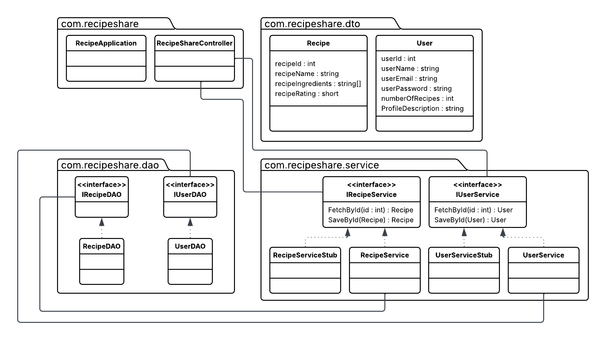

# 1. Introduction
## Recipe Sharing & Meal Planning Platform
We decided on a Recipe and Meal Sharing "Platform" which would allow users to create and share recipes for meals much like a social media platform where recipes can be posted, tagged, and reviewed by other users. We're looking to put in a bit of work into the UI to make it look a bit like X/Twitter, where one can scroll down a list of recipes from a user.
### Core Features:
- User authentication and profiles - we'll be looking to include these in a technical sense, but to allow for time on the rest of the project, the profiles and authentication steps will likely be the bare minimum.
- Recipe creation, editing, and sharing - The main feature of the app will focus on the recipes, listing ingredients, and posting the meal.
- Shopping list generation - As this is ingredient-focused, there'll be a feature to generate a shopping list based off of the recipes you view.
- Recipe rating and reviews - Acting like our version of liking/retweeting posts, meals will be able to be rated by other users from 1-5 Stars
- Meal planning calendar - If time permits, we plan to include a calendar that one can add meals to, whether by links to a post or copying a meal to the day.

### Technical Implementation:
- UI Layer: Templates with Bootstrap for recipe browsing, meal planning calendar

- Business Logic: Recipe recommendation engine (by ratings), meal plan algorithms, shopping list optimization

- Persistence: JPA/Hibernate for recipes, users, meal plans, ratings

- External Integration: Storage for recipe images

- JSON APIs: RESTful endpoints for mobile app potential

# 2. Storyboard:
### A user writing a recipe and posting it

### A user finding a recipe and rating it

# 3. Functional Requirements
# Functional Requirements - User Stories

## 1. User Authentication and Profile Management

**As a** food enthusiast
**I want** to register and manage my profile
**So that I can** create, share, and track my recipes while viewing my cooking statistics

### Examples:

* **Given** I am an unregistered user
* **When** I navigate to the registration page, enter a valid email "user@example.com", password "SecurePass123!", and confirm password
* **Then** my account is created, I receive confirmation, and I can log in with these credentials

* **Given** I am a registered user with saved recipes
* **When** I log in and navigate to my profile page
* **Then** I see my created recipes, total recipe count, average rating received, and profile statistics

* **Given** I am logged in as user "chef_alice"
* **When** I attempt to edit a recipe created by user "baker_bob"
* **Then** the system prevents the action and displays the "You can only edit your own recipes" error message

* **Given** I am logged in with an existing profile
* **When** I update my profile information with invalid data (empty email field)
* **Then** the system shows validation errors and prevents saving until all required fields are properly filled

## 2. Recipe Creation and Management

**As a** recipe creator
**I want** to create, edit, and delete recipes with detailed information
**So that I can** share my cooking knowledge and maintain my recipe collection

### Examples:

* **Given** I am an authenticated user
* **When** I create a new recipe with the name "Chocolate Chip Cookies", the ingredients list ["2 cups flour", "1 cup sugar"], and instructions "Mix ingredients and bake"
* **Then** a unique recipe ID is assigned, the recipe is saved, and I can view it in my profile

* **Given** I have a recipe with optional fields missing
* **When** I add cooking time "30 minutes", servings "4", and difficulty level "Easy"
* **Then** the recipe is updated with complete information and displays properly in search results

* **Given** I am the author of recipe ID 123
* **When** I click delete and confirm the deletion prompt
* **Then** the recipe is permanently removed from the system and no longer appears in searches or my profile

* **Given** I am editing my recipe
* **When** I attempt to save with missing required fields (empty ingredients list)
* **Then** validation errors appear, highlighting missing fields, and the save is prevented until corrected

## 3. Recipe Discovery and Rating System

**As a** recipe browser
**I want** to search, filter, and rate recipes
**So that I can** discover new dishes and share feedback with the community

### Examples:

* **Given** the system contains recipes with various names and tags
* **When** I search for "chocolate" and filter by the "dessert" category
* **Then** I see all dessert recipes containing "chocolate" in the name, sorted by relevance or rating

* **Given** I am viewing a recipe I haven't rated
* **When** I select 4 stars and submit my rating
* **Then** my rating is recorded, the recipe's average rating updates, and I cannot rate this recipe again

* **Given** I previously rated a recipe 3 stars
* **When** I change my rating to 5 stars
* **Then** my old rating is replaced, the average rating recalculates, and the new rating is displayed

* **Given** I am viewing my own recipe
* **When** I attempt to rate it
* **Then** the rating interface is disabled with the message "You cannot rate your own recipes."

## 4. Recipe Sharing and Social Features

**As a** recipe sharer
**I want** to share recipes through various channels and view them in a social feed
**So that I can** spread cooking inspiration and engage with the cooking community

### Examples:

* **Given** I am viewing a recipe detail page
* **When** I click the share button and select "Generate Link"
* **Then** a shareable URL is created that allows anyone to view the recipe without authentication

* **Given** I am on the main feed page
* **When** the page loads
* **Then** I see recipes displayed in chronological order with images, ratings, brief descriptions, and creator information

* **Given** I want to print a recipe for offline cooking
* **When** I click the print button on recipe "Beef Stew"
* **Then** a printer-friendly version opens with optimized formatting showing ingredients, instructions, and cooking details

* **Given** the system has recipes with similar ingredients
* **When** I view a pasta recipe containing tomatoes and basil
* **Then** the recommendation section shows other recipes with tomatoes and basil, ordered by rating and similarity

# 4. Class Diagram

# 5. JSON Scheme

Schema for Recipe
> {
>  "type": "object",
>  "properties": {
>    "recipeId": { "type": "integer" },
>    "recipeName": { "type": "string" },
>    "recipeIngredients": {
>      "type": "array",
>      "items": { "type": "string" }
>    },
>    "recipeRating": { "type": "integer" }
>  }
> }

Schema for User
> {
>  "type": "object",
>  "properties": {
>    "userId": { "type": "integer" },
>    "userName": { "type": "string" },
>    "userEmail": { "type": "string", "format": "email" },
>    "userPassword": { "type": "string" },
>    "numberOfRecipes": { "type": "integer" },
>    "profileDescription": { "type": "string" }
>  }
> }

# 6. Scrum Roles
Eric Coomer - Business Logic and Persistence

Alicia Davoyan - UI

Jaecar Ly - Github Admin/Product Owner/Scrum Master

Dan Rice - UI

Hari Sathyanarayanan - Business Logic and Persistence

# 7. [Github.com Link](https://github.com/Eric-C2/Enterprise-Application-Development-Group-8)

# 8. [Sprint Board](https://lucid.app/lucidspark/eca2b01a-7fca-4850-8af8-8ef2eb186a2e/edit?view_items=zKEUMnlM3hkO&invitationId=inv_25b91ee9-e6c7-4887-be69-d839de4ea22b)

# 9. [Link to Teams](https://teams.microsoft.com/l/chat/19:a7b58f8bc1514dba87d412eaeeb0b98c@thread.v2/conversations?context=%7B%22contextType%22%3A%22chat%22%7D)
